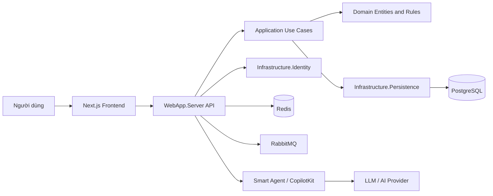

# Tổng hợp mô hình code và cấu trúc project

## 1. Tổng quan

Smart Recruitment là hệ thống tuyển dụng gồm ba khối chính:

1. **Backend ASP.NET Core**: cung cấp REST API, xác thực, nghiệp vụ tuyển dụng, truy cập database và kết nối dịch vụ hạ tầng.
2. **Frontend Next.js**: giao diện web cho ứng viên, nhà tuyển dụng và các chức năng tương tác với AI agent.
3. **Smart Agent**: dịch vụ AI viết bằng .NET, hỗ trợ hội thoại / trợ lý thông minh và được backend công bố qua AG-UI/CopilotKit.

Solution backend là `RecruitmentSmart.sln`, được tổ chức theo mô hình **Clean Architecture / Onion Architecture**:

```text
WebApp.Server -> Application -> Domain
WebApp.Server -> Infrastructure.Identity
WebApp.Server -> Infrastructure.Persistence
Infrastructure.Identity -> Infrastructure.Shared
Infrastructure.Persistence -> Infrastructure.Shared
Infrastructure.Shared -> Application
Application -> Domain
```

Nguyên tắc phụ thuộc chính: `Domain` chứa mô hình nghiệp vụ cốt lõi và không phụ thuộc vào tầng bên ngoài; các tầng còn lại triển khai dịch vụ và kết nối kỹ thuật xung quanh Domain.

---

## 2. Cấu trúc thư mục cấp cao

```text
Smart_Recruitment/
├── RecruitmentSmart.sln
├── README.md
├── DATABASE_DESIGN.md
├── PROJECT_STRUCTURE.md
├── docker-compose.yml
├── docker-command.md
├── dotnet-install.ps1
├── .env.example
├── src/
│   ├── Domain/
│   ├── Application/
│   ├── Infrastructure/
│   │   ├── Infrastructure.Identity/
│   │   ├── Infrastructure.Persistence/
│   │   └── Infrastructure.Shared/
│   └── WebApi/
│       ├── WebApp.Server/
│       └── frontend/
└── smart/
    ├── agent/
    ├── src/
    ├── public/
    ├── scripts/
    └── channel-host.mts / channels.mts
```

---

## 3. Solution và các project .NET

Solution `RecruitmentSmart.sln` khai báo 6 project .NET, được nhóm trong Visual Studio thành `Core`, `Infrastructure` và `WebApp`. Project `ProverbsAgent` là project .NET độc lập trong thư mục `smart/`, không được khai báo trong solution này.

| Project | Đường dẫn | Vai trò |
|---|---|---|
| `Domain` | `src/Domain/Domain.csproj` | Entity, enum, base model và cấu hình domain |
| `Application` | `src/Application/Application.csproj` | Use case, DTO, validation, mapping và interface |
| `Infrastructure.Identity` | `src/Infrastructure/Infrastructure.Identity/` | ASP.NET Identity, JWT, user/role và dịch vụ xác thực |
| `Infrastructure.Persistence` | `src/Infrastructure/Infrastructure.Persistence/` | EF Core DbContext, migration, repository và cấu hình database |
| `Infrastructure.Shared` | `src/Infrastructure/Infrastructure.Shared/` | Dịch vụ dùng chung như email và cấu hình hạ tầng |
| `WebApp.Server` | `src/WebApi/WebApp.Server/` | API host, controller, middleware, DI và khởi động ứng dụng |
| `ProverbsAgent` | `smart/agent/ProverbsAgent.csproj` | Agent AI .NET chạy độc lập trong container |

Các project backend sử dụng `net10.0` theo các file `.csproj` hiện tại.

---

## 4. Tầng Domain

Đường dẫn: `src/Domain/`

```text
Domain/
├── Domain.csproj
├── Common/
│   ├── BaseEntity.cs
│   └── AuditableBaseEntity.cs
├── Entities/
│   ├── nguoiDung.cs
│   ├── hoSoUngVien.cs
│   ├── hoSoNhaTuyenDung.cs
│   ├── doanhNghiep.cs
│   ├── tinTuyenDung.cs
│   ├── danhMucNghe.cs
│   ├── kyNang.cs
│   ├── kyNangUngVien.cs
│   ├── kyNangTinTuyenDung.cs
│   ├── cvUngVien.cs
│   ├── ketQuaPhanTichCv.cs
│   ├── donUngTuyen.cs
│   ├── lichPhongVan.cs
│   ├── ketQuaPhuHop.cs
│   ├── kinhNghiemLamViec.cs
│   ├── thongBao.cs
│   └── danhGia.cs
├── Enums/
│   ├── VaiTroNguoiDung.cs
│   ├── TrangThaiTinTuyenDung.cs
│   ├── TrangThaiDonUngTuyen.cs
│   ├── TrangThaiLichPhongVan.cs
│   ├── LoaiThongBao.cs
│   └── PhanLoaiKetQua.cs
└── Settings/
    ├── JWTSettings.cs
    └── MailSettings.cs
```

### Vai trò

- `Common`: định nghĩa `Id` và metadata audit (`Created`, `CreatedBy`, `LastModified`, `LastModifiedBy`).
- `Entities`: mô hình dữ liệu nghiệp vụ, tương ứng với các `DbSet` trong `ApplicationDbContext`.
- `Enums`: các giá trị trạng thái/vai trò được lưu trong các cột của entity; đây không phải bảng riêng.
- `Settings`: class ánh xạ cấu hình JWT và SMTP; không phải bảng database.

Domain hiện mô tả đầy đủ các nghiệp vụ chính: tài khoản, ứng viên, doanh nghiệp, tin tuyển dụng, CV, kỹ năng, ứng tuyển, phỏng vấn, thông báo và matching CV-job.

---

## 5. Tầng Application

Đường dẫn: `src/Application/`

```text
Application/
├── Application.csproj
├── ServiceExtensions.cs
├── Behaviours/
│   └── ValidationBehaviour.cs
├── DTOs/
│   ├── Account/
│   ├── Email/
│   └── HoSoUngVien/
├── Exceptions/
│   ├── ApiException.cs
│   └── ValidationException.cs
├── Extensions/
│   └── MethodExtensions.cs
├── Features/
│   ├── HoSoUngVien/
│   └── Products/
├── Interfaces/
│   ├── IAccountService.cs
│   ├── IApplicationDbContext.cs
│   ├── IAuthenticatedUserService.cs
│   ├── IDateTimeService.cs
│   ├── IEmailService.cs
│   ├── IGenericRepositoryAsync.cs
│   └── Repositories/
├── Mappings/
│   └── GeneralProfile.cs
├── Parameters/
│   └── RequestParameter.cs
└── Wrappers/
    ├── PagedList.cs
    ├── PagedResponse.cs
    └── Response.cs
```

### Cách hoạt động

- `Features`: chứa logic theo từng chức năng/use case, thường là nơi đặt request, handler và validator theo MediatR.
- `DTOs`: object dùng để nhận/trả dữ liệu API, tránh để entity Domain làm hợp đồng API trực tiếp.
- `Interfaces`: abstraction cho database, repository, email, thời gian và user hiện tại. Application chỉ biết interface, không biết chi tiết PostgreSQL hay SMTP.
- `Behaviours`: pipeline behavior của MediatR; `ValidationBehaviour` kiểm tra request trước khi handler chạy.
- `Mappings`: cấu hình AutoMapper giữa entity và DTO.
- `Wrappers`: chuẩn hóa response, phân trang và danh sách kết quả.
- `Exceptions`: loại lỗi nghiệp vụ/API/validation để middleware xử lý thống nhất.
- `ServiceExtensions.cs`: đăng ký MediatR, FluentValidation, AutoMapper và validation pipeline bằng `AddApplicationLayer()`.

Application sử dụng các thư viện chính như MediatR, FluentValidation, AutoMapper, MassTransit, Redis, Polly và NEST.

---

## 6. Tầng Infrastructure

### 6.1 Infrastructure.Persistence

Đường dẫn: `src/Infrastructure/Infrastructure.Persistence/`

```text
Infrastructure.Persistence/
├── Infrastructure.Persistence.csproj
├── Contexts/
│   └── ApplicationDbContext.cs
├── Configurations/
├── Migrations/
├── Repositories/
└── ServiceRegistration.cs
```

Vai trò:

- `ApplicationDbContext`: DbContext chính của nghiệp vụ, đăng ký 17 `DbSet` cho các entity Domain.
- `Configurations`: cấu hình khóa, quan hệ, tên cột và quy tắc EF Core nếu có.
- `Migrations`: lịch sử đồng bộ schema database.
- `Repositories`: triển khai generic repository và repository cụ thể.
- `ServiceRegistration.cs`: đăng ký persistence services vào Dependency Injection.

Database quan hệ đang dùng PostgreSQL thông qua `Npgsql.EntityFrameworkCore.PostgreSQL`. Các thuộc tính `decimal` trong `ApplicationDbContext` được cấu hình về `decimal(18,6)`.

`SaveChangesAsync` tự động cập nhật thông tin audit cho entity kế thừa `AuditableBaseEntity`.

### 6.2 Infrastructure.Identity

Đường dẫn: `src/Infrastructure/Infrastructure.Identity/`

```text
Infrastructure.Identity/
├── Infrastructure.Identity.csproj
├── Contexts/
├── Features/
├── Helpers/
├── Migrations/
├── Models/
├── Seeds/
├── Services/
└── ServiceExtensions.cs
```

Vai trò:

- Tích hợp ASP.NET Core Identity.
- Quản lý user, role, claim, password và JWT bearer authentication.
- Lưu schema Identity bằng EF Core và PostgreSQL.
- `Seeds`: dữ liệu khởi tạo như tài khoản/quyền mặc định.
- `Services`: triển khai các interface xác thực và tài khoản từ Application.

### 6.3 Infrastructure.Shared

Đường dẫn: `src/Infrastructure/Infrastructure.Shared/`

```text
Infrastructure.Shared/
├── Infrastructure.Shared.csproj
├── Environments/
├── Services/
└── ServiceRegistration.cs
```

Chứa các dịch vụ dùng chung giữa các module infrastructure, nổi bật là email/SMTP và các cấu hình hạ tầng. `MailSettings` từ Domain được dùng để bind cấu hình gửi email.

---

## 7. WebApp.Server

Đường dẫn: `src/WebApi/WebApp.Server/`

```text
WebApp.Server/
├── WebApp.Server.csproj
├── Program.cs
├── appsettings.json
├── Controllers/
│   ├── BaseApiController.cs
│   ├── AccountController.cs
│   ├── UsersController.cs
│   ├── RolesController.cs
│   ├── RoleClaimsController.cs
│   └── v1/
├── Extensions/
├── Initializer/
├── Middlewares/
├── Models/
├── Services/
├── Properties/
├── Dockerfile
└── wwwroot/
```

### Vai trò các nhóm file

- `Program.cs`: entry point; nạp biến môi trường, đăng ký CORS, Identity, Application, Persistence, Shared infrastructure, Swagger, health check và controller.
- `Controllers`: điểm vào HTTP của REST API; controller nhận request và gọi Application services/use case.
- `Extensions`: các method mở rộng để gom cấu hình DI, Swagger, API versioning, Identity và infrastructure.
- `Middlewares`: xử lý lỗi và các concern dùng chung trong HTTP pipeline.
- `Initializer`: khởi tạo dữ liệu/cấu hình khi ứng dụng chạy.
- `Models`: model phục vụ lớp Web API.
- `wwwroot`: static files, đồng thời được dùng làm thư mục chứa file cấu hình cho một số thành phần host.
- `Dockerfile`: đóng gói backend thành image Linux.

HTTP pipeline hiện gồm static files, routing, CORS, authorization, error handling, health check và map controllers. Swagger được bật trong môi trường Development.

Ngoài REST API, backend còn expose AI endpoint:

```text
/api/copilotkit
```

Endpoint này được map bằng `MapAGUIServer` và dùng `SmartAgentFactory` để tạo agent.

---

## 8. Frontend Next.js

Đường dẫn: `src/WebApi/frontend/`

```text
frontend/
├── package.json
├── next.config.ts
├── tsconfig.json
├── eslint.config.mjs
├── postcss.config.mjs
├── Dockerfile.dev
├── app/
│   ├── layout.tsx
│   ├── page.tsx
│   ├── globals.css
│   ├── css/
│   ├── providers/
│   └── api/
├── components/
│   └── ui/
├── hooks/
├── lib/
└── public/
```

### Vai trò

- `app/`: App Router của Next.js; `layout.tsx` là layout dùng chung, `page.tsx` là trang giao diện, `api/` chứa route handler hoặc lớp gọi API theo cấu trúc hiện tại.
- `components/`: component React tái sử dụng; `ui/` chứa các component giao diện nhỏ.
- `hooks/`: custom React hooks.
- `lib/`: utility, API client, kiểu dữ liệu và hàm dùng chung.
- `providers/`: Context/provider cho state hoặc thư viện tích hợp.
- `public/`: hình ảnh, font và tài nguyên tĩnh.
- `Dockerfile.dev`: chạy frontend trong Docker ở chế độ phát triển.

Frontend dùng Next.js 16, React 19, TypeScript, Axios, React Hook Form, Zod và CopilotKit/AG-UI. API backend mặc định được cấu hình qua `NEXT_PUBLIC_API_URL`.

---

## 9. Smart Agent

Thư mục `smart/` là một workspace Node/TypeScript phục vụ giao tiếp với agent và CopilotKit, bên cạnh agent .NET trong `smart/agent/`.

```text
smart/
├── package.json
├── tsconfig.json
├── tsconfig.channel.json
├── next.config.ts
├── channel-host.mts
├── channels.mts
├── src/
│   ├── agent.ts
│   ├── app/
│   ├── components/
│   └── lib/
├── agent/
│   ├── ProverbsAgent.csproj
│   ├── Program.cs
│   ├── SharedStateAgent.cs
│   ├── appsettings.json
│   └── Dockerfile
├── fixtures/
├── public/
└── scripts/
```

- `smart/src/agent.ts`: cấu hình/kết nối agent phía TypeScript.
- `smart/src/app/`: UI và route của workspace agent.
- `smart/src/components/`: component agent như chat, weather, proverbs hoặc moon.
- `channel-host.mts`, `channels.mts`: host và định nghĩa kênh giao tiếp AG-UI/CopilotKit.
- `smart/agent/Program.cs`: entry point của agent .NET.
- `SharedStateAgent.cs`, `ProverbsAgent.csproj`: logic và project mẫu/agent dùng chung state.
- `scripts/`: script chạy, setup agent và khởi động hạ tầng phát triển.

Workspace này dùng Next.js, React, TypeScript, CopilotKit, AG-UI, Hono, Zod và `tsx`.

---

## 10. Hạ tầng chạy bằng Docker

File [docker-compose.yml](docker-compose.yml) định nghĩa các service:

| Service | Port | Vai trò |
|---|---:|---|
| `postgres` | `5432` | Database PostgreSQL |
| `redis` | `6379` | Cache / distributed state |
| `rabbitmq` | `5672`, `15672` | Message broker và management UI |
| `backend` | `5000 -> 8080` | ASP.NET Core API |
| `smart_agent` | `8000` | AI agent .NET |
| `frontend` | `3000` | Next.js web app |

Các service dùng network Docker `kltn_network`. Backend kết nối tới database bằng hostname `postgres`, cache bằng `redis`, message broker bằng `rabbitmq` và agent bằng `smart_agent`.

Lệnh thường dùng:

```text
docker compose up -d --build
docker compose down
```

Sau khi chạy, các địa chỉ chính là:

- Frontend: `http://localhost:3000`
- Backend/Swagger: `http://localhost:5000/swagger/index.html`
- Health check: `http://localhost:5000/health`
- RabbitMQ management: `http://localhost:15672`

---

## 11. Luồng xử lý tổng quát



Một request nghiệp vụ điển hình:

1. Frontend gửi HTTP request tới `WebApp.Server`.
2. Controller nhận request và chuyển dữ liệu sang DTO/request của Application.
3. MediatR handler thực hiện use case; FluentValidation kiểm tra dữ liệu.
4. Handler dùng interface repository/DbContext do Application định nghĩa.
5. Infrastructure triển khai truy vấn PostgreSQL hoặc gọi dịch vụ ngoài.
6. Kết quả được map bằng AutoMapper và trả về response chuẩn hóa.
7. Các tác vụ bất đồng bộ có thể dùng RabbitMQ/MassTransit; dữ liệu tạm hoặc state dùng Redis.

---

## 12. Quy ước đọc và mở rộng code

Khi thêm một chức năng mới, nên đi theo thứ tự:

1. Bổ sung hoặc điều chỉnh entity/enum trong `Domain` nếu có nghiệp vụ hoặc dữ liệu mới.
2. Tạo DTO, request, handler, validator và mapping trong `Application/Features`.
3. Khai báo interface cần thiết trong `Application/Interfaces`.
4. Triển khai repository, database configuration hoặc service trong `Infrastructure`.
5. Tạo controller/endpoint trong `WebApp.Server/Controllers`.
6. Cập nhật migration nếu schema thay đổi.
7. Cập nhật frontend trong `frontend/app`, `components`, `hooks` hoặc `lib`.
8. Cập nhật Docker/configuration nếu service hoặc biến môi trường mới được thêm.

Cách tổ chức này giữ cho nghiệp vụ không bị phụ thuộc trực tiếp vào controller, database provider hoặc giao diện người dùng.

---

## 13. Nhận xét hiện trạng

- Cấu trúc tổng thể đã phân tách rõ domain, application, infrastructure và presentation.
- `ApplicationDbContext` hiện đăng ký 17 entity nghiệp vụ, phù hợp với tài liệu database.
- `Enums` là kiểu dữ liệu dùng trong entity, không phải bảng database độc lập.
- Backend đang đồng thời tham chiếu nhiều phiên bản package .NET 10.x giữa các project; khi build/deploy nên kiểm tra tính tương thích package.
- Project có cả `smart/` và `src/WebApi/frontend/` cùng sử dụng Next.js/CopilotKit. Cần xác định rõ frontend nào là giao diện chính và `smart/` là workspace agent/dev để tránh trùng trách nhiệm.
- `docker-compose.yml` khai báo database mặc định là `smart_recruitment_db` cho service PostgreSQL nhưng connection string backend đang dùng database `KLTN`; nên đồng bộ hai tên database trước khi triển khai sạch từ đầu.

---

## 14. Kết luận

Project sử dụng kiến trúc nhiều tầng, trong đó:

- `Domain` giữ mô hình và quy tắc nghiệp vụ cốt lõi.
- `Application` điều phối use case và hợp đồng giữa các tầng.
- `Infrastructure` triển khai database, Identity, email, cache và message broker.
- `WebApp.Server` là host API và điểm tích hợp AI.
- `frontend` cung cấp giao diện Next.js.
- `smart` cung cấp workspace và agent AI hỗ trợ CopilotKit/AG-UI.

Đây là nền tảng phù hợp để mở rộng hệ thống tuyển dụng theo hướng Clean Architecture, đồng thời tích hợp các chức năng AI/ML, thông báo bất đồng bộ và tìm kiếm/gợi ý nâng cao.
