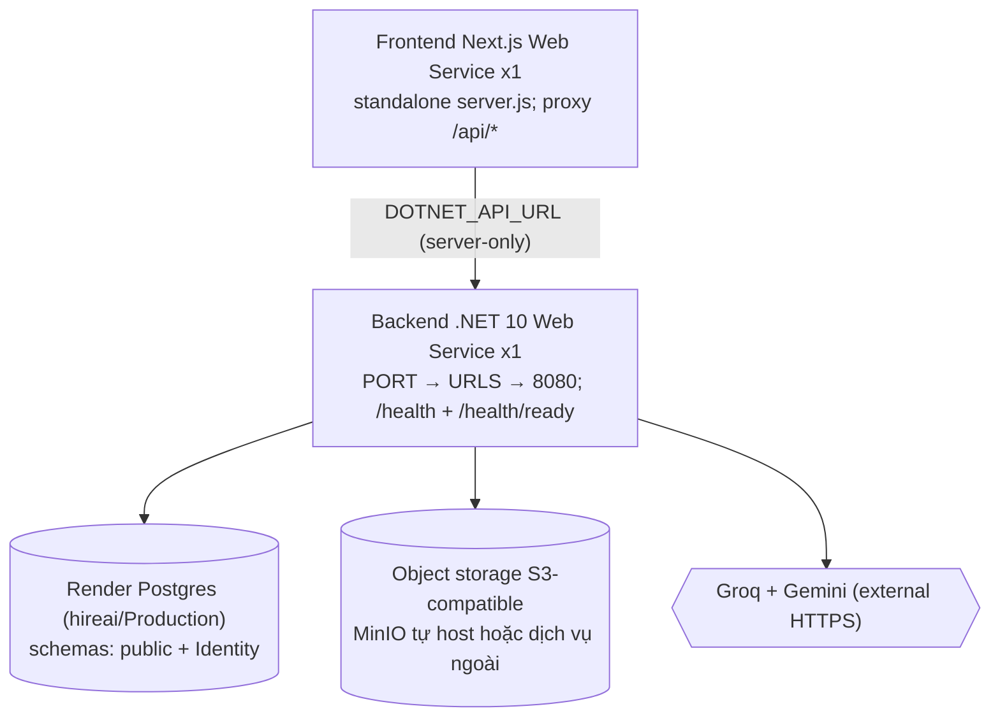

# Triển khai Smart Recruitment (HireAI) lên Render — Production

> Tài liệu vận hành sau các thay đổi production-readiness (Task A→G).
> Nguyên tắc: KHÔNG deploy tự động; mọi secret điền trực tiếp trên Render Dashboard.
> Local Docker Compose giữ nguyên cho development (Redis/RabbitMQ vẫn ở compose local,
> không deploy lên production vì chưa có caller thực tế — không xóa code local).

## 1. Kiến trúc production

- 1 replica Backend + 1 replica Frontend (tránh race seed `policy.csv`, SignalR
  in-memory không backplane, background jobs hourly không distributed lock).
- Redis/RabbitMQ: không deploy (dead code đã xác minh bằng grep 0 caller).
- pgvector: không cần (schema chỉ dùng kiểu Postgres chuẩn).

## 2. Service cần triển khai

| # | Service Render | Loại | Ghi chú |
|---|---|---|---|
| 0 | PostgreSQL | Managed (ĐÃ CÓ — project `hireai`, Production) | Không chạm cho tới khi sẵn sàng migrate/seed |
| 1 | Backend | Web Service (Docker, context root, `src/WebApi/WebApp.Server/Dockerfile`) | Health check `/health` |
| 2 | Frontend | Web Service (Docker, context `src/WebApi/frontend`, `Dockerfile`) | Health check `/` |
| 3 | Object storage | MinIO tự host (Web Service + Disk) HOẶC S3-compatible ngoài | **Chưa chốt — blocker** |

## 3. Cấu hình Render Backend

- **Build:** Docker, repository root, Dockerfile Path
  `src/WebApi/WebApp.Server/Dockerfile`. Không dùng dev compose.
- **Start:** mặc định (`dotnet WebApp.Server.dll`). Lắng nghe: `PORT` (Render cấp)
  → `ASPNETCORE_URLS` (nếu có) → fallback `8080`. Không set `ASPNETCORE_URLS` tay
  trên Render.
- **Env:** `ASPNETCORE_ENVIRONMENT=Production` + toàn bộ biến mục 5.
- **Health Check Path:** `/health` (liveness). `/health/ready` kiểm tra database
  (dùng nội bộ, kỳ vọng 200 khi DB reachable, 503 khi không).
- **Chú ý:** `ForwardedHeaders` chỉ áp dụng `X-Forwarded-For/Proto` từ proxy đáng
  tin (mặc định loopback, KHÔNG trust-all). Nếu sau deploy `Request.Scheme`/IP sai
  (redirect, callback, cookie Secure), bổ sung IP egress của Render vào
  `KnownProxies/KnownNetworks` trong `Program.cs` khi có thông tin xác thực —
  xem TODO trong code.

## 4. Cấu hình Render Frontend

- **Build:** Docker, Root Directory `src/WebApi/frontend`, Dockerfile `Dockerfile`
  (multi-stage, `npm ci` → `next build` → standalone `server.js`).
- **Start:** `node server.js`. Lắng nghe `0.0.0.0`, cổng `$PORT`, fallback `3000`.
- **Env bắt buộc:** `DOTNET_API_URL=https://<backend>.onrender.com` (server-only).
  Thiếu → proxy trả `500 dotnet_api_not_configured`, không fallback localhost.
- **Env public:** chỉ `NEXT_PUBLIC_GOOGLE_CLIENT_ID` (nếu dùng Google login).
  Không đưa secret vào `NEXT_PUBLIC_*`.

## 5. Biến môi trường (bắt buộc / tùy chọn)

Xem `.env.production.example` (placeholder, không secret thật).

| Biến | Bắt buộc? | Ghi chú |
|---|---|---|
| `ConnectionStrings__PostgresConnection` (hoặc `POSTGRES_CONNECTION_STRING`) | Có | URL Render PG (+ `Ssl Mode=Require` nếu bắt SSL) |
| `JWTSettings__Key/__Issuer/__Audience` (+ `__DurationInMinutes`) | Có | Key Base64 ≥32B tự sinh; thiếu → crash fail-fast |
| `Seed__EnableDefaultUsers/__AdminEmail/__AdminPassword` | Lần đầu | Mặc định `false`; bật 1 lần rồi tắt (mục 9) |
| `Seed__AdminUserName`, `Seed__BasicUserPassword` | Tùy chọn | Username admin; password demo khi seed demo |
| `Frontend__AllowedOrigins` | Có | `;`-separated, không `*`; thiếu → crash fail-fast |
| `Groq__ApiKey` (hoặc `GROQ_API_KEY`) | Có nếu dùng AI agent | Thiếu → lỗi rõ lúc resolve agent |
| `Gemini__ApiKey`, `Gemini__Model` | Có nếu parse CV | Thiếu → warn startup, lỗi lúc parse |
| `Minio__Endpoint/PublicEndpoint/AccessKey/SecretKey/BucketName/UseSSL` | Có | Prod từ chối localhost, `PublicEndpoint` HTTPS public bắt buộc |
| `MailSettings__*`, `GoogleSettings__ClientId` | Tùy chọn | Theo tính năng dùng |
| `DOTNET_API_URL` (FE) | Có | URL backend nội bộ/public |
| `NEXT_PUBLIC_GOOGLE_CLIENT_ID` (FE) | Tùy chọn | Đồng bộ với backend `GoogleSettings__ClientId` |

## 6. PostgreSQL

1. Lấy Internal + External URL của database `hireai`/Production trên dashboard.
2. Read-only kiểm tra (KHÔNG migrate khi chưa sẵn sàng):
   `SELECT version();`, quyền owner/CREATE schema, test SSL (`sslmode=require`).
3. Deploy Backend lần đầu sẽ tự `Migrate()` cả 2 context (thứ tự
   Application → Identity) rồi seed roles (+ admin nếu bật `Seed__*`).
   Migration lỗi ở Production → backend crash fail-fast (không healthy giả).
4. Kiểm tra: 2 bảng `__EFMigrationsHistory` ở schema `public` + `Identity`;
   bảng nghiệp vụ + `Identity.*` đầy đủ.

## 7. Object storage (**BLOCKER — chưa chốt provider**)

- Giữ MinIO SDK + `IFileStorageService`; presigned URL được **ký lại bằng
  publicClient riêng**, không thay hostname trên URL đã ký.
- Khi thiếu/sai config prod, backend fail-fast với message nêu rõ biến thiếu
  (không fallback localhost, không trả presigned sai).
- Lựa chọn: (a) S3-compatible ngoài (khuyến nghị demo: khỏi lo Disk,
  presigned HTTPS ổn định); (b) MinIO tự host trên Render (cần Disk persist +
  domain HTTPS public cho `PublicEndpoint`).
- Yêu cầu với mọi lựa chọn: `Endpoint` backend tới được; `PublicEndpoint`
  browser tới được qua HTTPS; `UseSSL=true`; bucket tồn tại hoặc cho phép
  `MakeBucket`; credentials ở backend, không xuống frontend; KHÔNG public bucket.
- Chưa tạo bucket/kết nối production trong task này.

## 8. Thứ tự deploy

1. Xác minh PG (mục 6) → 2. Chốt storage + chuẩn bị bucket (mục 7) →
3. Khai env Backend → 4. Deploy Backend → 5. Kiểm tra migrate/seed (mục 9) →
6. Khai env Frontend (`DOTNET_API_URL`) → 7. Deploy Frontend →
8. Kiểm thử E2E (mục 10) → 9. Tắt `Seed__EnableDefaultUsers`, backup PG.

## 9. Kiểm tra migration và seed

- Log startup: `Migrate` 2 context OK, `Đã hoàn thành bơm dữ liệu mặc định!`.
- `Seed__EnableDefaultUsers=true` + email/password mạnh → admin tạo 1 lần.
  Restart tiếp theo: KHÔNG reset password/unlock/quyền (verify bằng cách đổi
  password admin rồi restart → password giữ nguyên).
- Ngay sau lần đầu: set `Seed__EnableDefaultUsers=false` (redeploy) để khóa seed.
- Dev local: không set `Seed__*` → không tạo tài khoản mới, dữ liệu hiện có giữ nguyên.

## 10. Kiểm thử E2E (sau deploy)

1. Đăng nhập admin (JWT), bashua basic flow.
2. Phân quyền: user thường bị 403 endpoint admin; Casbin `policy.csv` regen từ DB.
3. Upload CV → `save-version` → `download-url` (presigned tải được trong 300s).
4. AI CopilotKit streaming qua `/api/copilotkit` (SSE, không rớt giữa chừng).
5. SignalR chuông thông báo (`/api/hubs/notifications`, SSE/LongPolling).
6. Avatar upload/serve/delete.
7. Restart BE/FE: CV còn nguyên (nhờ storage ngoài/Disk), không mất policy.

## 11. Log và rollback

- Log: Render Logs (Serilog console). Lỗi migrate/seed ở prod ghi `Error` đầy đủ
  (không credentials) rồi crash — xem log để chẩn đoán, sửa config, redeploy.
- Rollback Backend/Frontend: Render → Deployments → redeploy bản trước.
- Rollback DB: restore từ backup PG Render (tạo backup trước mỗi lần đổi seed/migrate).
- Rollback seed lỗi: tắt `Seed__EnableDefaultUsers`, kiểm tra bảng `Identity.User/Role`.
